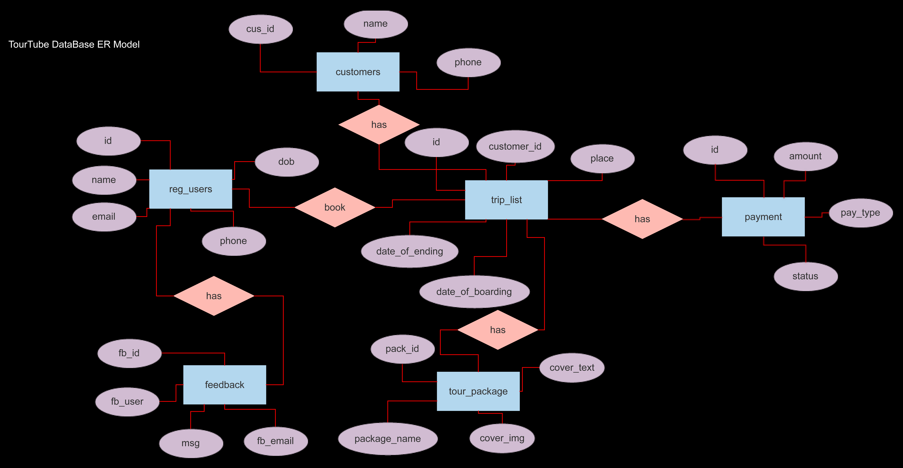
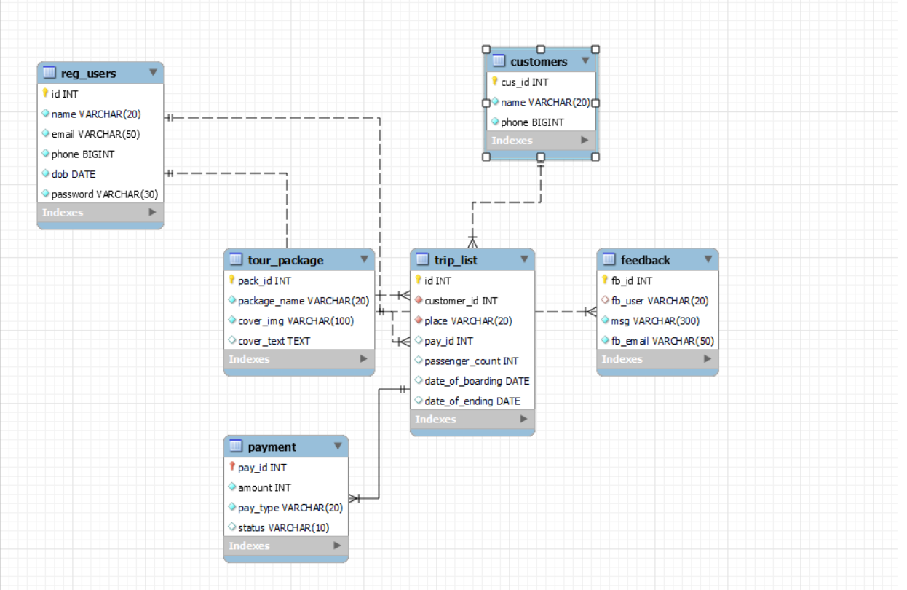

# TourTube Database Table Output:

### Tables:
1. customers
2. feedback
3. payment
4. reg_users
5. tour_package
6. trip_list

``` sql
 show tables;

| Tables_in_tourtube |
|:-------------------|
| customers          |
| feedback           |
| payment            |
| reg_users          |
| tour_package       |
| trip_list          |
6 rows in set (0.01 sec)
```
***
| Tables_in_tourtube |
|:-------------------|
| customers          |
| feedback           |
| payment            |
| reg_users          |
| tour_package       |
| trip_list          |

### Creating of Database Tables;
``` sql
 create table customers(cus_id int primary key, name varchar(20) not null, phone bigint not null);
```
``` sql
 create table feedback (fb_id int primary key, fb_user varchar(20), msg text(300) not null, fb_email varchar(50) not null);
```
```sql
 create table payment(pay_id int primary key, amount int not null, pay_type varchar(20) not null, status varchar(10) default 'not-paid');
```
``` sql
 create table reg_users (id int primary key, name varchar(20) unique not null, email varchar(50) unique not null, phone bigint unique not null, dob date not null, password varchar(30) not null);
```
``` sql
 create table tour_package (pack_id int primary key, package_name varchar(20) unique not null, cover_img varchar(100) unique not null, cover_text text);
```
``` sql
 create table trip_list (id int primary key, customer_id int unique not null, place varchar(20) unique not null, pay_id int unique, passenger_count int, date_of_boarding date , date_of_ending date);
```

***
### Insertion of Data into Tables:
``` sql
insert into customers values(1, 'Sanboi', 8870522547), (2, GunaVenlin, 6387628723), (3, Abimanyu, 7654321981);
```

``` sql 
insert into feedback values(1, 'Sanboi', 'Your service is good', 'santhanu236@gmail.com'), 
                           (2, 'Guna', 'Your website has some bugs, kindly fix it', 'gunavenlin@gmail.com');
```

``` sql
insert into payment values(1, 45000, 'card', 'paid'), (2, 23000, 'net-banking', 'paid');
```

``` sql
insert into reg_users values(1, 'Sanboi', 'santhanu236@gmail.com', 8870522547, 2002-22-15, 'password01').
                            (2, 'Guna', 'gunavenlin@gmail.com', 6388763542, 0000-00-00, 'password02'),
                            (3, 'Abimanyu', 'abimanyuabi@gmail.com', 8765432982, 0000-00-00, 'password03'),
                            (4, 'Javid', 'javithegangster@gmail.com', 7654321988, 0000-00-00, 'password04'),
                            (5, 'Komal', 'komalkishan@gmail.com', 8765432198, 0000-00-00, 'password05');
```

``` sql
insert into reg_users values(1, 'Sanboi', 'santhanu236@gmail.com', 8870522547, 2002-22-15, 'password01').
                            (2, 'Guna', 'gunavenlin@gmail.com', 6388763542, 0000-00-00, 'password02'),
                            (3, 'Abimanyu', 'abimanyuabi@gmail.com', 8765432982, 0000-00-00, 'password03'),
                            (4, 'Javid', 'javithegangster@gmail.com', 7654321988, 0000-00-00, 'password04'),
                            (5, 'Komal', 'komalkishan@gmail.com', 8765432198, 0000-00-00, 'password05');

```

``` sql
insert into tour_package values(1, 'Hawaii', 'http://cdn.cnn.com/cnnnext/dam/assets/201230100452-10-2021-travel-destinations-hawaii.jpg', 'Hawaii is a state in the Western United States, located in the Pacific Ocean about 2,000 miles from the U.S. mainland. It is the only state outside North America, the only state that is an archipelago, and the only state in the tropics'),
(2, 'Maldives', 'https://image.com/maldives.png', 'Maldives, officially the Republic of Maldives, is an archipelagic country in the Indian subcontinent of Asia, situated in the Indian Ocean. It lies southwest of Sri Lanka and India, about 750 kilometres from the Asian continents mainland.'),
(3, 'Kerala', ' https://image.com/kerala.png', ' Kerala, a state on Indias tropical Malabar Coast, has nearly 600km of Arabian Sea shoreline. Its known for its palm-lined beaches and backwaters, a network of canals.'),
(4, 'Switzerland', 'https://image.com/swizz.png', 'Switzerland is a mountainous Central European country, home to numerous lakes, villages and the high peaks of the Alps.'),
(5, 'Shimla', 'https://image.com/shimla.png', 'Shimla is the capital of the northern Indian state of Himachal Pradesh, in the Himalayan foothills.');
```

``` sql
insert into trip_list values(1, 1, 'Hawaii', 1, 3, 0000-00-00, 0000-00-00),
(2, 2, 'Kerala', 2, 2, 0000-00-00, 0000-00-00);

```
### Customers Table:
``` sql
 desc customers;
+--------+-------------+------+-----+---------+-------+
| Field  | Type        | Null | Key | Default | Extra |
+--------+-------------+------+-----+---------+-------+
| cus_id | int         | NO   | PRI | NULL    |       |
| name   | varchar(20) | NO   |     | NULL    |       |
| phone  | bigint      | NO   |     | NULL    |       |
+--------+-------------+------+-----+---------+-------+
3 rows in set (0.02 sec)
```

| Field  | Type        | Null | Key | Default | Extra |
|--------|-------------|------|-----|---------|-------|
| cus_id | int         | NO   | PRI | NULL    |       |
| name   | varchar(20) | NO   |     | NULL    |       |
| phone  | bigint      | NO   |     | NULL    |       |

***
``` sql
 select * from customers;
+--------+------------+------------+
| cus_id | name       | phone      |
+--------+------------+------------+
|      1 | Sanboi     | 8870522547 |
|      2 | GunaVenlin | 6387628723 |
|      3 | Abimanyu   | 7654321981 |
+--------+------------+------------+
3 rows in set (0.00 sec)
```

| cus_id | name       | phone      |
|--------|------------|------------|
|      1 | Sanboi     | 8870522547 |
|      2 | GunaVenlin | 6387628723 |
|      3 | Abimanyu   | 7654321981 |
***

### Feedback Table:
``` sql
 desc feedback
    -> ;
+----------+--------------+------+-----+---------+-------+
| Field    | Type         | Null | Key | Default | Extra |
+----------+--------------+------+-----+---------+-------+
| fb_id    | int          | NO   | PRI | NULL    |       |
| fb_user  | varchar(20)  | YES  | MUL | NULL    |       |
| msg      | varchar(300) | NO   |     | NULL    |       |
| fb_email | varchar(50)  | NO   |     | NULL    |       |
+----------+--------------+------+-----+---------+-------+
4 rows in set (0.01 sec)
```

| Field    | Type         | Null | Key | Default | Extra |
|----------|--------------|------|-----|---------|-------|
| fb_id    | int          | NO   | PRI | NULL    |       |
| fb_user  | varchar(20)  | YES  | MUL | NULL    |       |
| msg      | varchar(300) | NO   |     | NULL    |       |
| fb_email | varchar(50)  | NO   |     | NULL    |       |
***
``` sql
 select * from feedback;
+-------+---------+-------------------------------------------+-----------------------+
| fb_id | fb_user | msg                                       | fb_email              |
+-------+---------+-------------------------------------------+-----------------------+
|     1 | Sanboi  | Your service is good                      | santhanu236@gmail.com |
|     2 | Guna    | Your website has some bugs, kindly fix it | gunavenlin@gmail.com  |
+-------+---------+-------------------------------------------+-----------------------+
2 rows in set (0.00 sec)
```

| fb_id | fb_user | msg                                       | fb_email              |
|-------|---------|-------------------------------------------|-----------------------|
|     1 | Sanboi  | Your service is good                      | santhanu236@gmail.com |
|     2 | Guna    | Your website has some bugs, kindly fix it | gunavenlin@gmail.com  |
*** 
### Payment Table:
``` sql
 desc payment;
+----------+-------------+------+-----+----------+-------+
| Field    | Type        | Null | Key | Default  | Extra |
+----------+-------------+------+-----+----------+-------+
| pay_id   | int         | NO   | PRI | NULL     |       |
| amount   | int         | NO   |     | NULL     |       |
| pay_type | varchar(20) | NO   |     | NULL     |       |
| status   | varchar(10) | YES  |     | not-paid |       |
+----------+-------------+------+-----+----------+-------+
4 rows in set (0.01 sec)
```

| Field    | Type        | Null | Key | Default  | Extra |
|----------|-------------|------|-----|----------|-------|
| pay_id   | int         | NO   | PRI | NULL     |       |
| amount   | int         | NO   |     | NULL     |       |
| pay_type | varchar(20) | NO   |     | NULL     |       |
| status   | varchar(10) | YES  |     | not-paid |       |

``` sql
 select * from payment;
+--------+--------+-------------+--------+
| pay_id | amount | pay_type    | status |
+--------+--------+-------------+--------+
|      1 |  45000 | card        | paid   |
|      2 |  23000 | net-banking | paid   |
+--------+--------+-------------+--------+
2 rows in set (0.01 sec)
```

| pay_id | amount | pay_type    | status |
|--------|--------|-------------|--------|
|      1 |  45000 | card        | paid   |
|      2 |  23000 | net-banking | paid   |

***

### reg_users Table:
``` sql
 desc reg_users;
+----------+-------------+------+-----+---------+-------+
| Field    | Type        | Null | Key | Default | Extra |
+----------+-------------+------+-----+---------+-------+
| id       | int         | NO   | PRI | NULL    |       |
| name     | varchar(20) | NO   | UNI | NULL    |       |
| email    | varchar(50) | NO   | UNI | NULL    |       |
| phone    | bigint      | NO   | UNI | NULL    |       |
| dob      | date        | NO   |     | NULL    |       |
| password | varchar(30) | NO   |     | NULL    |       |
+----------+-------------+------+-----+---------+-------+
6 rows in set (0.00 sec)
```

| Field    | Type        | Null | Key | Default | Extra |
|----------|-------------|------|-----|---------|-------|
| id       | int         | NO   | PRI | NULL    |       |
| name     | varchar(20) | NO   | UNI | NULL    |       |
| email    | varchar(50) | NO   | UNI | NULL    |       |
| phone    | bigint      | NO   | UNI | NULL    |       |
| dob      | date        | NO   |     | NULL    |       |
| password | varchar(30) | NO   |     | NULL    |       |

``` sql
 select * from reg_users;
+----+----------+---------------------------+------------+------------+------------+
| id | name     | email                     | phone      | dob        | password   |
+----+----------+---------------------------+------------+------------+------------+
|  1 | Sanboi   | santhanu236@gmail.com     | 8870522547 | 2002-11-15 | password01 |
|  2 | Guna     | gunavenlin@gmail.com      | 6388763542 | 0000-00-00 | password02 |
|  3 | Abimanyu | abimanyuabi@gmail.com     | 8765432982 | 0000-00-00 | password03 |
|  4 | Javid    | javithegangster@gmail.com | 7654321988 | 0000-00-00 | password04 |
|  5 | Komal    | komalkishan@gmail.com     | 8765432198 | 0000-00-00 | password05 |
+----+----------+---------------------------+------------+------------+------------+
5 rows in set (0.00 sec)
```

| id | name     | email                     | phone      | dob        | password   |
|----|----------|---------------------------|------------|------------|------------|
|  1 | Sanboi   | santhanu236@gmail.com     | 8870522547 | 2002-11-15 | password01 |
|  2 | Guna     | gunavenlin@gmail.com      | 6388763542 | 0000-00-00 | password02 |
|  3 | Abimanyu | abimanyuabi@gmail.com     | 8765432982 | 0000-00-00 | password03 |
|  4 | Javid    | javithegangster@gmail.com | 7654321988 | 0000-00-00 | password04 |
|  5 | Komal    | komalkishan@gmail.com     | 8765432198 | 0000-00-00 | password05 |
***

### tour_package Table:
``` sql
 desc tour_package;
+--------------+--------------+------+-----+---------+-------+
| Field        | Type         | Null | Key | Default | Extra |
+--------------+--------------+------+-----+---------+-------+
| pack_id      | int          | NO   | PRI | NULL    |       |
| package_name | varchar(20)  | NO   | UNI | NULL    |       |
| cover_img    | varchar(100) | NO   | UNI | NULL    |       |
| cover_text   | text         | YES  |     | NULL    |       |
+--------------+--------------+------+-----+---------+-------+
4 rows in set (0.00 sec)
```

| Field        | Type         | Null | Key | Default | Extra |
|--------------|--------------|------|-----|---------|-------|
| pack_id      | int          | NO   | PRI | NULL    |       |
| package_name | varchar(20)  | NO   | UNI | NULL    |       |
| cover_img    | varchar(100) | NO   | UNI | NULL    |       |
| cover_text   | text         | YES  |     | NULL    |       |

``` sql
 select * from tour_package;
+---------+--------------+-------------------------------------------------------------------------------------------+------------------------------------------------------------------------------------------------------------------------------------------------------------------------------------------------------------------------------------------------+
| pack_id | package_name | cover_img                                                                                 | cover_text
                                                                                                                                                                          |
+---------+--------------+-------------------------------------------------------------------------------------------+------------------------------------------------------------------------------------------------------------------------------------------------------------------------------------------------------------------------------------------------+
|       1 | Hawaii       | http://cdn.cnn.com/cnnnext/dam/assets/201230100452-10-2021-travel-destinations-hawaii.jpg | Hawaii is a state in the Western United States, located in the Pacific Ocean about 2,000 miles from the U.S. mainland. It is the only state outside North America, the only state that is an archipelago, and the only state in the tropics    |
|       2 | Maldives     | https://image.com/maldives.png                                                            | Maldives, officially the Republic of Maldives, is an archipelagic country in the Indian subcontinent of Asia, situated in the Indian Ocean. It lies southwest of Sri Lanka and India, about 750 kilometres from the Asian continents mainland. |
|       3 | Kerala       | https://image.com/kerala.png                                                              | Kerala, a state on Indias tropical Malabar Coast, has nearly 600km of Arabian Sea shoreline. Its known for its palm-lined beaches and backwaters, a network of canals.                                                                         |
|       4 | Switzerland  | https://image.com/swizz.png                                                               | Switzerland is a mountainous Central European country, home to numerous lakes, villages and the high peaks of the Alps.                                                                                                                        |
|       5 | Shimla       | https://image.com/shimla.png                                                              | Shimla is the capital of the northern Indian state of Himachal Pradesh, in the Himalayan foothills.                                                                                                                                            |
+---------+--------------+-------------------------------------------------------------------------------------------+------------------------------------------------------------------------------------------------------------------------------------------------------------------------------------------------------------------------------------------------+
5 rows in set (0.01 sec)
```
                                                                                                                                   
### trip_list Table:

``` sql
 desc trip_list;
+------------------+-------------+------+-----+---------+-------+
| Field            | Type        | Null | Key | Default | Extra |
+------------------+-------------+------+-----+---------+-------+
| id               | int         | NO   | PRI | NULL    |       |
| customer_id      | int         | NO   | UNI | NULL    |       |
| place            | varchar(20) | NO   | MUL | NULL    |       |
| pay_id           | int         | YES  | UNI | NULL    |       |
| passenger_count  | int         | YES  |     | NULL    |       |
| date_of_boarding | date        | YES  |     | NULL    |       |
| date_of_ending   | date        | YES  |     | NULL    |       |
+------------------+-------------+------+-----+---------+-------+
7 rows in set (0.00 sec)
```

| Field            | Type        | Null | Key | Default | Extra |
|------------------|-------------|------|-----|---------|-------|
| id               | int         | NO   | PRI | NULL    |       |
| customer_id      | int         | NO   | UNI | NULL    |       |
| place            | varchar(20) | NO   | MUL | NULL    |       |
| pay_id           | int         | YES  | UNI | NULL    |       |
| passenger_count  | int         | YES  |     | NULL    |       |
| date_of_boarding | date        | YES  |     | NULL    |       |
| date_of_ending   | date        | YES  |     | NULL    |       |

``` sql
 select * from trip_list;
+----+-------------+--------+--------+-----------------+------------------+----------------+
| id | customer_id | place  | pay_id | passenger_count | date_of_boarding | date_of_ending |
+----+-------------+--------+--------+-----------------+------------------+----------------+
|  1 |           1 | Hawaii |      1 |               3 | 0000-00-00       | 0000-00-00     |
|  2 |           2 | Kerala |      2 |               2 | 0000-00-00       | 0000-00-00     |
+----+-------------+--------+--------+-----------------+------------------+----------------+
2 rows in set (0.01 sec)
```

| id | customer_id | place  | pay_id | passenger_count | date_of_boarding | date_of_ending |
|----|-------------|--------|--------|-----------------|------------------|----------------|
|  1 |           1 | Hawaii |      1 |               3 | 0000-00-00       | 0000-00-00     |
|  2 |           2 | Kerala |      2 |               2 | 0000-00-00       | 0000-00-00     |
***

## ER Model for TourTube Database:

***
## ER Model (workbench):



